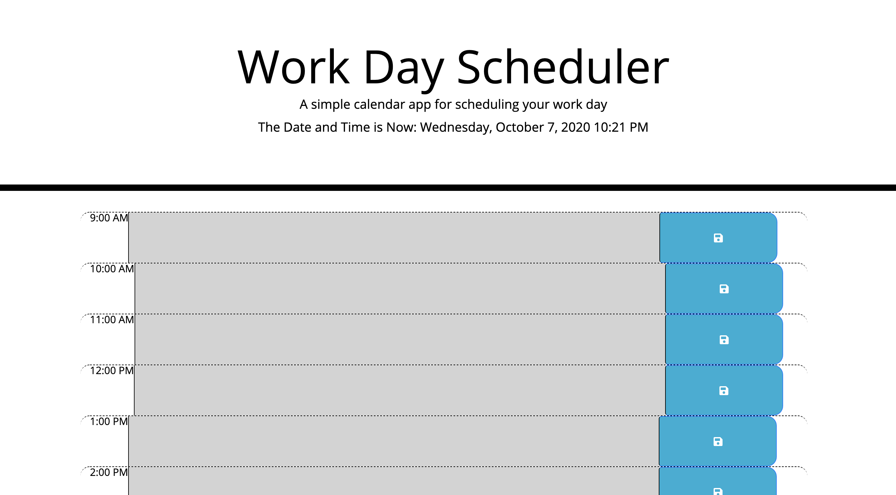

# work-day-scheduler

## About

This project allows you to traverse the calender and place in content for you day as you prepare your day. You can use my application here - https://dcampbell2.github.io/work-day-scheduler/.

## Usage

When a time is in the future the time block will show as green to type in text. If the hour is currently in the present it will show as red and if its in the past it will show as grey.

